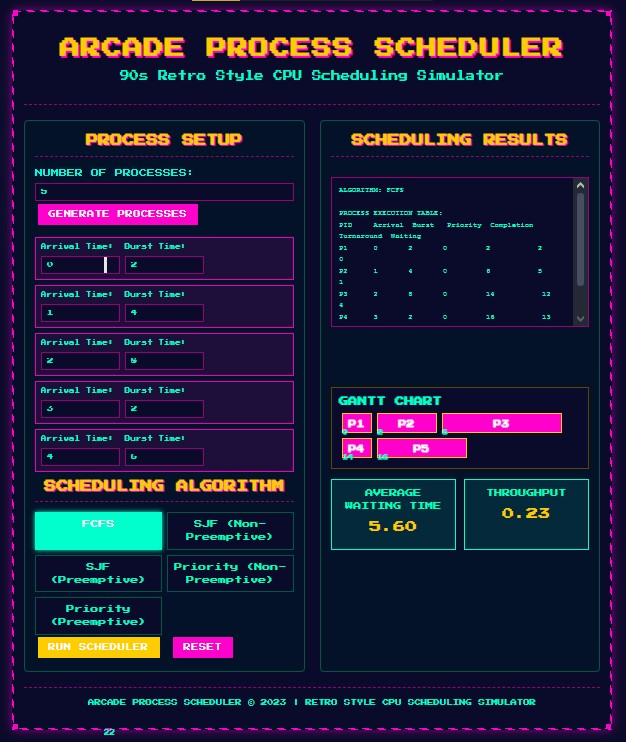
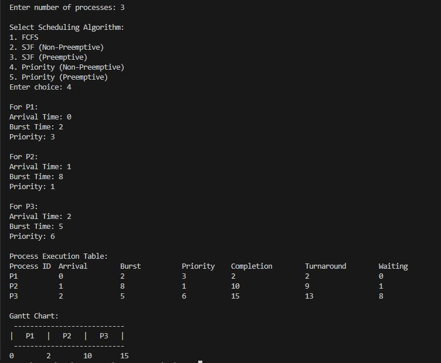
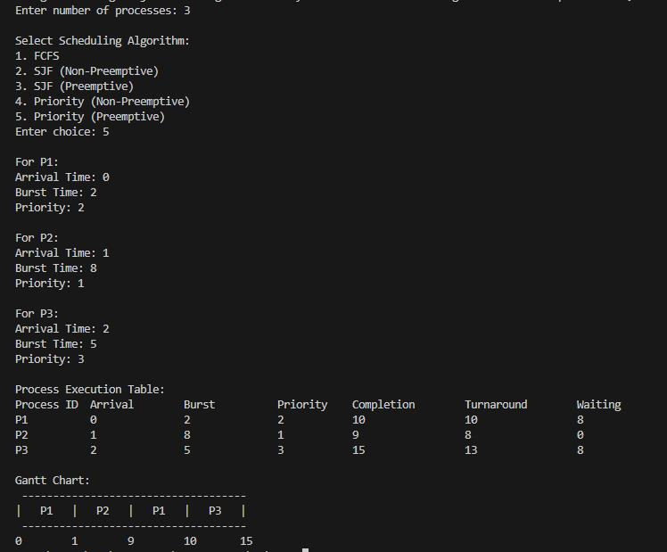
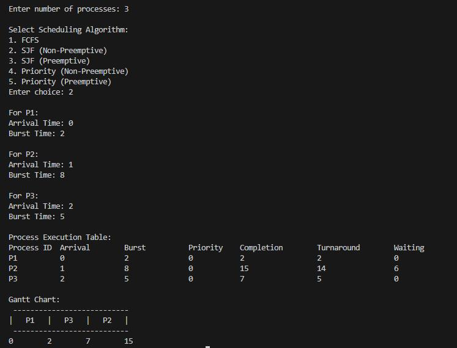
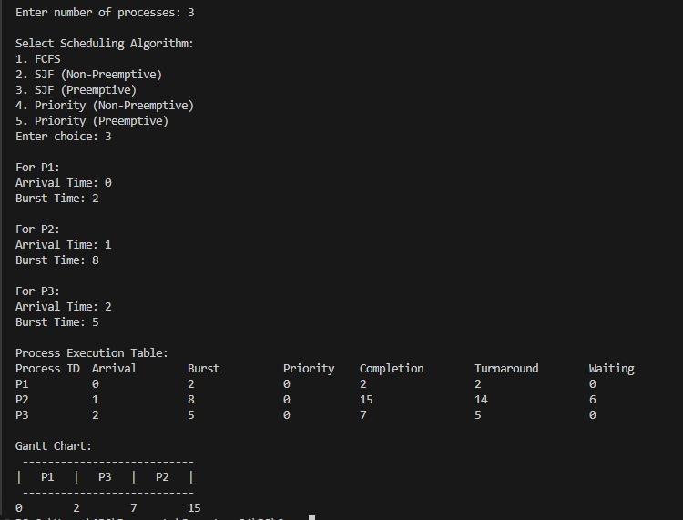

# 🎮 Arcade Process Scheduler

A retro-styled CPU scheduling simulator that visualizes five different process scheduling algorithms with a 90s arcade aesthetic. Built with C++ backend and HTML/CSS/JavaScript frontend.

**Key Features**:
- ✅ 5 Scheduling Algorithms (FCFS, SJF, Priority - both preemptive and non-preemptive)
- ✅ Interactive Gantt Charts with real-time visualization
- ✅ Performance Metrics (waiting time, throughput, turnaround time)
- ✅ Retro Arcade UI with pixel-perfect design
- ✅ Cross-platform (web-based frontend with C++ backend)

---

## 📖 Overview

This project implements a comprehensive CPU scheduling simulator that demonstrates how different scheduling algorithms manage processes in an operating system. The C++ backend provides the core scheduling logic, while the web-based frontend offers an engaging, visual interface with a nostalgic 90s arcade theme.

---

## 🚀 Quick Start

### 1. C++ Backend (Console Version)
```bash
# Compile the C++ program
g++ -o scheduler scheduler.cpp

# Run the executable
./scheduler
```
### 2. Web Interface
```bash
# Simply open the HTML file in your browser
open index.html
# or
xdg-open index.html
# or double-click the file
```
### 3. Basic Usage Example
```cpp
// Create processes
Process processes[3] = {
    Process(1, 0, 5, 2),  // PID, Arrival, Burst, Priority
    Process(2, 1, 3, 1),
    Process(3, 2, 8, 3)
};

// Run FCFS scheduler
FCFS scheduler(processes, 3);
scheduler.run();
scheduler.printTable();
scheduler.printGanttChart();
```

---

## ⚙️ Scheduling Algorithms

| Algorithm | Type | Key Characteristic |
|---------|-----------|------------|
| FCFS | Non-preemptive	| First-come, first-served |
| SJF | Non-preemptive | Shortest job first |
| Preemptive SJF | Preemptive | Shortest remaining time first |
| Priority | Non-preemptive | Lowest priority number first |
| Preemptive Priority | Preemptive | Priority-based preemption |

---

## 📊 Performance Metrics

The simulator calculates and displays:
- **Average Waiting Time** - Total time processes spend waiting
- **Throughput** - Processes completed per time unit
- **Turnaround Time** - Total time from arrival to completion
- **Gantt Chart** - Visual timeline of process execution

---

## 🗂️ Project Structure

```text
├── scheduler.cpp          # C++ backend with all scheduling algorithms
├── index.html            # Web frontend with interactive UI
├── assets/               # Graphics and styling resources
└── README.md            # Project documentation
```

---

## 🎯 How to Use

### Web Interface:
1. Set the number of processes (1-10)
2. Configure arrival times, burst times, and priorities
3. Select a scheduling algorithm
4. Click "RUN SCHEDULER" to see results
5. View the Gantt chart and performance metrics

### C++ Version:

1. Compile the program
2. Run the executable
3, Follow the interactive prompts
4. View the results in console format

## 🔧 Technical Implementation

### Backend (C++):

- Object-oriented design with base scheduler class
- Five concrete scheduler implementations
- Process management with comprehensive metrics
- Gantt chart generation for visualization

### Frontend (Web):

- Pure HTML/CSS/JavaScript (no external dependencies)
- 90s retro arcade styling with pixel borders
- Real-time algorithm simulation
- Interactive process configuration

---

## 📸 Demo

### First Come First Serve


### Priority Non Preemptive


### Priority Preemptive


### ShortestJob First Non Preemptive


### ShortestJob First Preemptive


---

## 👤 Author

- [Aleeza Rizwan](https://github.com/its-aleezA)
- [Ibrahim Abdullah](https://github.com/Ibrahim5570)

## 📜 License

This project is licensed under the MIT License. See [LICENSE](LICENSE) for details.

---

_Note: Educational tool for understanding CPU scheduling algorithms. Not intended for production use._

